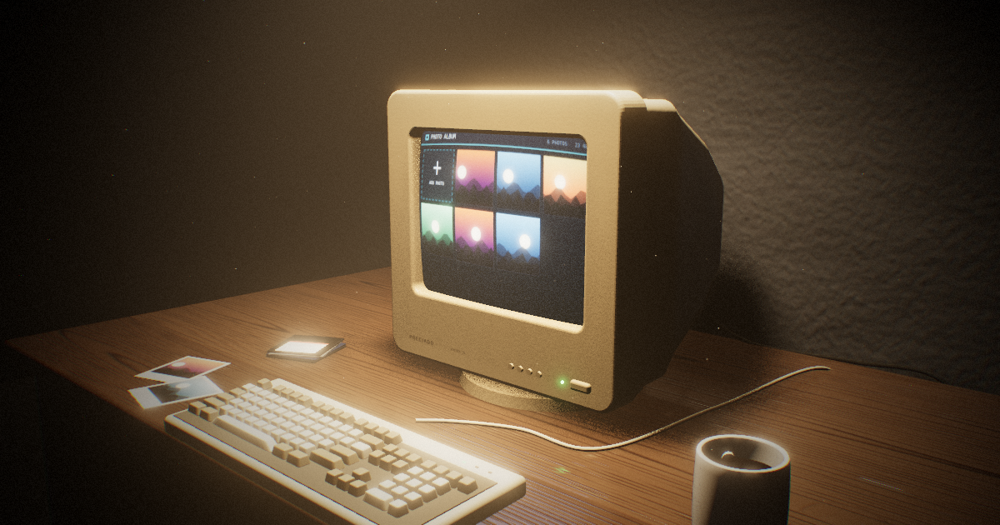

# CRT Album

A beige 90s CRT on a walnut desk, in a dark room lit by a single pendant lamp. Upload photos, browse them on the tube, and save any of them with the CRT look baked in.



Built by Michael Preciado / Preciado Tech with **TypeScript, Three.js (WebGL2) and hand-written GLSL**. No UI framework: the render loop, input and post-processing are all under direct control, which is what keeps the lighting affordable on phones. Deploys to Vercel (Postgres for metadata, Blob for files).

## What's on screen

**Light and shadow**
- One warm pendant lamp is the only real light. It casts **PCSS soft shadows** (contact-hardening: sharp where the keyboard touches the desk, soft further away), injected into Three's shadow chunk.
- **Raymarched volumetric light**: each pixel marches through the lamp's cone and tests the shadow map, so the haze is only lit where light actually travels and the monitor casts a dark shaft through it.
- Dust motes drift through the beam and glint only inside the cone.
- The tube lights the room: a rect-area light in front of the glass takes its colour and brightness from what's on screen.

**Reflections**
- The lacquered desk has a **planar reflection** (mirrored camera + oblique clip plane) sampled through its roughness map, so glossy lacquer is sharp and worn patches blur. It's weighted by Fresnel, strongest at grazing angles.
- The CRT glass is a separate additive layer that adds only specular reflections of the room.
- A procedural dark-room environment map (lamp overhead, door-crack behind you) drives the reflections on plastic, ceramic and brass.

**Materials**: every texture is procedural and **baked on the GPU at load** (walnut boards with cathedral grain, pores and an old mug ring; orange-peel ABS; trowelled plaster; brushed aluminium; enamel). There are no image downloads, and the resolution follows the quality tier.

**The tube**: one shader models the picture: barrel faceplate, Gaussian beam scanlines that fatten on bright content, aperture-grille phosphors, halation from the mip chain, convergence error, a rolling hum bar, flicker and a dot, line, raster power-on. Scanline and mask detail fade by screen-space frequency, so a small or distant screen never shows moiré.

**Post**: HDR pipeline with MSAA, bloom, ACES tone mapping, then lens chromatic aberration, vignette and luminance-aware grain.

## Navigation

The screen runs a small photo OS drawn with Canvas2D and shown through the CRT shader. Fingers land on the exact pixel under them because pointers are ray-cast onto the faceplate and pushed through the same barrel mapping as the shader.

| | Touch | Mouse / trackpad | Keyboard |
| --- | --- | --- | --- |
| Room | Drag to look around, pinch to move closer, tap the screen | Drag, scroll, click the screen (or scroll all the way in) | Arrows look, `Enter` walks up to the screen |
| Gallery | Momentum scroll with rubber-band edges, tap a photo, tap outside the glass to step back | Scroll, click; hover highlights | Arrows move focus, `Enter` opens, `Esc` steps back |
| Photo | Swipe to page (the photo follows your finger), pinch or double-tap to zoom, drag to pan, swipe down to close | Wheel zoom at the cursor, drag to pan, click the edges for prev/next | `←` `→`, `+` `-` `0`, `S` saves, `Esc` closes |

Photos open out of their thumbnail and shrink back into it. Drag and drop images anywhere to upload.

## Mobile and performance

- Three quality tiers (DPR cap, MSAA, shadow-map size, PCSS samples, reflection resolution, volumetric steps, dust count). Phones start at *medium*; the engine steps down if it can't hold about 40 fps. Use `?quality=low|medium|high` to pin a tier.
- The shadow map is rendered once (the scene under the lamp is static). The reflection renders at 28–50% resolution.
- The screen texture only re-uploads when the OS redraws. Full-size photos are kept only around the one being viewed.
- The intro and UI entry chunk is about 16 KB. Three.js and the scene load in parallel while the intro plays, and every material is pre-compiled before the lamp turns on.
- Safe-area insets, `100dvh`, no page zoom on double-tap, 44 px touch targets, and share-sheet export on phones.

## Accessibility

- `prefers-reduced-motion` turns off camera flights, lamp flicker, jitter, grain and dust.
- The DOM controls (back, add, save, sound) are real buttons, and screen-reader announcements track the view.
- Browsers without WebGL2 get a plain accessible album.

## Quick start

```bash
npm install
npm run dev        # http://localhost:5173
npm run lint       # tsc + eslint (api/)
npm run build
npm run preview
```

Without the API the app shows sample photos and keeps uploads on the device for the session. For the full stack:

```bash
npm i -g vercel && vercel link && vercel env pull .env.local
npm run vercel-dev
```

## API

Vercel serverless routes in `api/`. They are unchanged from v1.

| Route | Description |
| --- | --- |
| `GET /api/images` | List images (newest first, max 500). `needsInit: true` if the table is missing. |
| `POST /api/upload` | `{ image: "data:image/...;base64,...", filename }` → `{ success, url }`. Validates size and type, including magic bytes. |
| `POST /api/init-db` | Create the table (protect with `INIT_SECRET`). |

The client resizes photos before upload so they stay under Vercel's roughly 4.5 MB body limit.

## Configuration

See `.env.example`: `BLOB_READ_WRITE_TOKEN`, `POSTGRES_*`, `APP_URL`, `INIT_SECRET`, `VITE_SITE_URL`.

## Project structure

```
api/                 Serverless routes
src/
  main.ts            Boot: intro UI, album, lazy 3D experience, fallback
  app/               Experience (scene assembly + render loop), input routing,
                     album/upload flow, CRT export, WebAudio foley, fallback
  core/              Quality tiers, PCSS, GPU texture baker, planar reflector,
                     camera rig, volumetric + finishing post passes
  scene/             Monitor, desk/walls/lamp/dust, props, procedural surfaces
  screen/            CRT shader, Canvas2D photo OS, image decoding queue
  ui/                DOM overlay (intro, HUD, hints, toasts, drop zone)
```

## License

MIT
